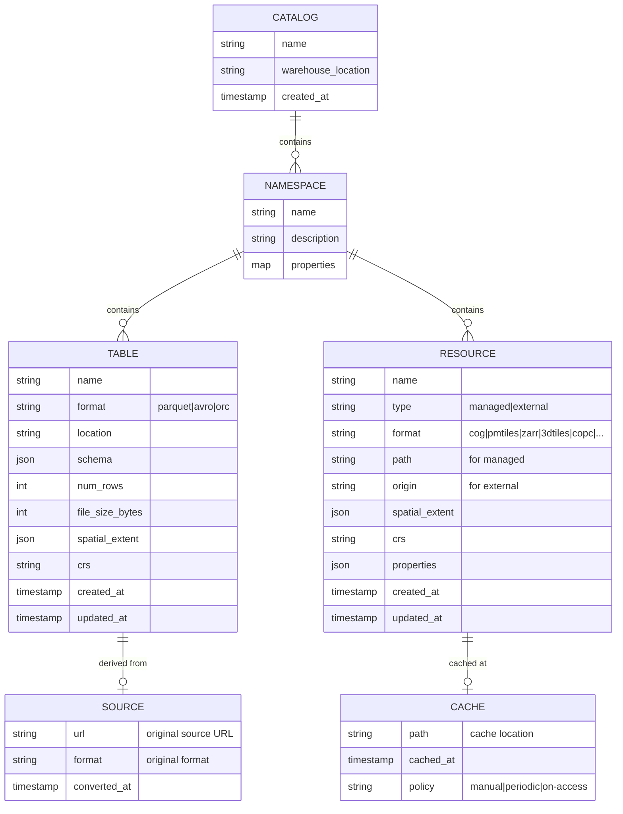
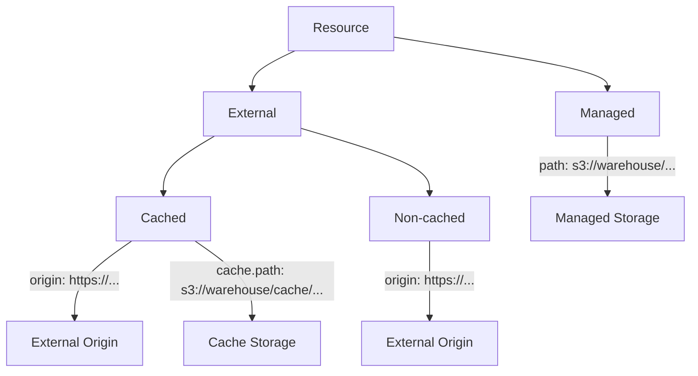

# Portolan Catalog Data Model

This document describes the data model for Portolan catalogs, including the distinction between **Tables** and **Resources**.

## Overview

A Portolan catalog contains two types of entries:

| Type | Description | Queryable | Storage |
|------|-------------|-----------|---------|
| **Table** | Iceberg table backed by Parquet/Avro/ORC | Yes (SQL) | Always managed |
| **Resource** | Reference to non-tabular data (COG, PMTiles, Zarr, etc.) | No (needs specialized tools) | Managed or external |

This separation allows the catalog to track both:
- Data that can be queried as tables (vectors, tabular data)
- Data that requires specialized tools (rasters, tiles, point clouds, n-dimensional arrays)

## Entity Relationship Diagram



## Tables

Tables are Iceberg tables backed by Parquet (or Avro/ORC). They are always stored in managed storage and are queryable via SQL using engines like DuckDB, Snowflake, BigQuery, Databricks, etc.

### Table Schema

| Field | Type | Required | Description |
|-------|------|----------|-------------|
| `name` | string | yes | Table identifier |
| `format` | string | yes | Data format: `parquet`, `avro`, `orc` |
| `location` | string | yes | Storage path (relative to warehouse) |
| `schema` | object | yes | Iceberg schema (JSON) |
| `num_rows` | integer | yes | Row count |
| `file_size_bytes` | integer | yes | Size of data files |
| `spatial_extent` | object | no | Bounding box: `{west, south, east, north}` |
| `crs` | string | no | Coordinate reference system (e.g., `EPSG:4326`) |
| `source` | object | no | Original source (for lineage) |
| `created_at` | timestamp | yes | Creation timestamp |
| `updated_at` | timestamp | yes | Last update timestamp |

### Source (Lineage)

When a table is derived from another source (e.g., converted from GeoJSON), the `source` field tracks the origin:

| Field | Type | Description |
|-------|------|-------------|
| `url` | string | Original source URL or path |
| `format` | string | Original format (e.g., `geojson`, `shapefile`) |
| `converted_at` | timestamp | When the conversion occurred |

## Resources

Resources are references to non-tabular data that cannot be represented as Iceberg tables. They require specialized tools to access and process.

### Supported Formats

| Format | Description | Example Tools |
|--------|-------------|---------------|
| `cog` | Cloud Optimized GeoTIFF | GDAL, rasterio, Titiler |
| `pmtiles` | Protomaps tiles archive | PMTiles viewer, MapLibre |
| `zarr` | N-dimensional arrays | Xarray, Zarr |
| `3dtiles` | 3D geospatial tiles | CesiumJS, deck.gl |
| `copc` | Cloud Optimized Point Cloud | PDAL, Potree |
| `flatgeobuf` | Streaming vector format | GDAL, leaflet-flatgeobuf |

### Resource Types

Resources are classified by storage location:



#### Managed Resources

Resources stored directly in Portolan-managed storage. Security controls are inherited from the storage layer.

```yaml
resource:
  name: imagery-2024
  type: managed
  format: cog
  path: s3://warehouse/data/imagery/2024.tif
  spatial_extent:
    west: -122.5
    south: 37.5
    east: -122.0
    north: 38.0
  crs: EPSG:4326
```

#### External Resources (Non-cached)

References to data hosted externally. Access is delegated to the external system.

```yaml
resource:
  name: sentinel-scene
  type: external
  format: cog
  origin: https://sentinel-cogs.s3.amazonaws.com/sentinel-s2-l2a-cogs/2024/...
  spatial_extent:
    west: -122.5
    south: 37.5
    east: -122.0
    north: 38.0
  crs: EPSG:4326
```

#### External Resources (Cached)

External resources with a local cache for improved SLA and performance.

```yaml
resource:
  name: basemap-tiles
  type: external
  format: pmtiles
  origin: https://external-provider.com/tiles/basemap.pmtiles
  cache:
    path: s3://warehouse/cache/basemap.pmtiles
    cached_at: 2026-02-01T12:00:00Z
    policy: periodic  # manual | periodic | on-access
  spatial_extent:
    west: -180
    south: -90
    east: 180
    north: 90
  crs: EPSG:4326
```

### Resource Schema

| Field | Type | Required | Description |
|-------|------|----------|-------------|
| `name` | string | yes | Resource identifier |
| `type` | string | yes | `managed` or `external` |
| `format` | string | yes | Data format (see supported formats) |
| `path` | string | if managed | Storage path for managed resources |
| `origin` | string | if external | External URL for external resources |
| `cache` | object | no | Cache configuration (external only) |
| `cache.path` | string | if cached | Cache storage path |
| `cache.cached_at` | timestamp | if cached | When the cache was created/updated |
| `cache.policy` | string | if cached | `manual`, `periodic`, or `on-access` |
| `spatial_extent` | object | no | Bounding box |
| `crs` | string | no | Coordinate reference system |
| `properties` | object | no | Format-specific metadata |
| `created_at` | timestamp | yes | Creation timestamp |
| `updated_at` | timestamp | yes | Last update timestamp |

## Security Model

Security depends on storage location:

| Entry Type | Storage | Security |
|------------|---------|----------|
| Table | Managed | Storage-level controls (IAM, policies) |
| Resource (managed) | Managed | Storage-level controls (IAM, policies) |
| Resource (external, non-cached) | External | Delegated to external system |
| Resource (external, cached) | Both | Managed for cache, external for refresh |

For external resources, the catalog may store **auth hints** (not credentials) to indicate what type of authentication is required:

```yaml
resource:
  name: private-imagery
  type: external
  origin: https://private-api.example.com/imagery.cog
  auth_hint: api-key  # none | api-key | oauth | s3-iam | signed-url
```

Actual credentials are never stored in the catalog. Clients are responsible for providing authentication.

## Catalog Storage Layout

```
warehouse/
├── v1/                           # Iceberg REST catalog endpoints
│   └── {prefix}/
│       └── namespaces/
│           └── {namespace}/
│               ├── tables/       # Table metadata
│               └── resources/    # Resource metadata (new)
├── data/
│   └── {namespace}/
│       ├── {table}/              # Table data (Parquet)
│       └── {resource}/           # Managed resource data
├── cache/                        # Cached external resources
│   └── {namespace}/
│       └── {resource}/
└── manifest.json                 # Catalog index
```

## CLI Operations

### Tables

```bash
# Add a table from Parquet file
portolan table add data.parquet --namespace geo --name boundaries

# Add with source lineage
portolan table add data.parquet --source https://example.com/boundaries.geojson

# List tables
portolan table list [--namespace <ns>]
```

### Resources

```bash
# Register a managed resource
portolan resource add imagery.tif --namespace geo --name imagery-2024

# Register an external resource
portolan resource add --external https://example.com/data.cog --name sentinel

# Cache an external resource
portolan resource cache sentinel

# Refresh a cached resource
portolan resource refresh sentinel

# Evict cache (keep reference)
portolan resource evict sentinel

# Convert resource to table (if format supports it)
portolan resource persist my-geojson --as my-table
```

### Import from External Catalogs

```bash
# Import from STAC catalog
portolan import stac https://earth-search.aws.element84.com/v1

# Import from ArcGIS Portal
portolan import arcgis https://portal.example.com/arcgis

# Import from CKAN
portolan import ckan https://data.gov
```

## Metadata Standards

Both tables and resources include STAC and ISO 19115 metadata where applicable:

| Standard | Purpose | Fields |
|----------|---------|--------|
| STAC | Interoperability | id, geometry, bbox, datetime, assets, links |
| ISO 19115 | SDI compliance | title, abstract, topic_category, lineage, constraints |

See the main [README](../README.md) for details on STAC + ISO 19115 integration.

## Future Considerations

- **Views**: Virtual tables defined by SQL queries over other tables
- **Collections**: Grouping mechanism for related tables and resources
- **Versioning**: Track changes to resources over time
- **Federation**: Reference tables/resources from other Portolan catalogs
