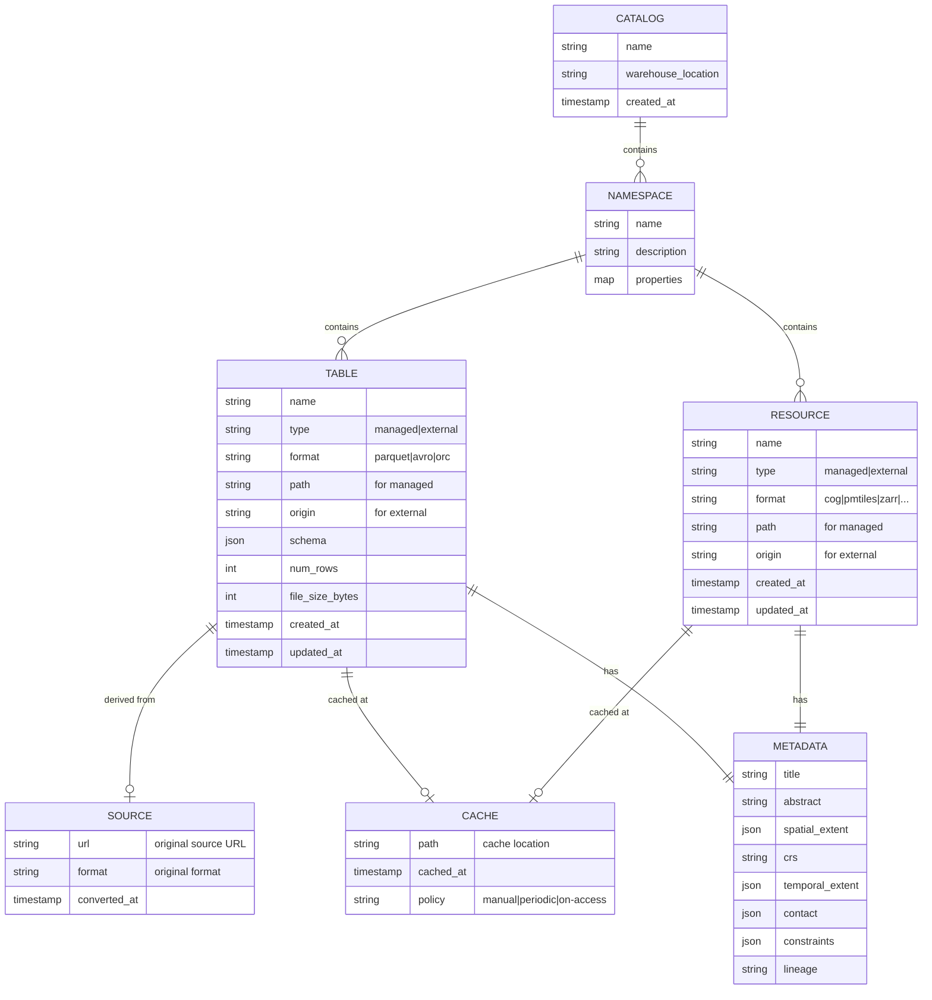
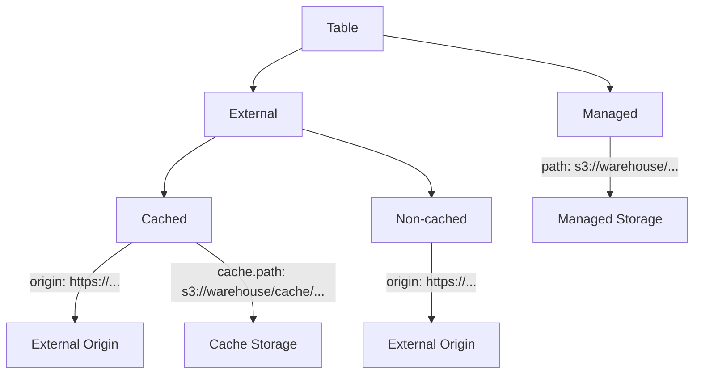
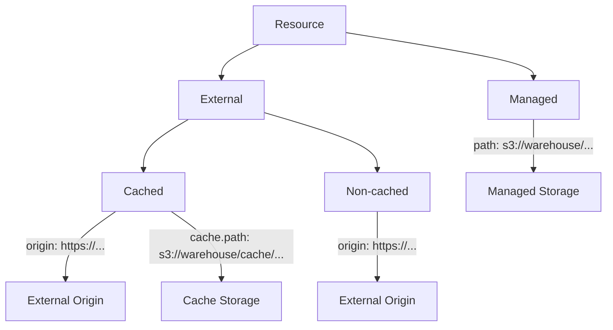

# Portolan Catalog Data Model

This document describes the data model for Portolan catalogs, including the distinction between **Tables** and **Resources**.

## Overview

A Portolan catalog contains two types of entries:

| Type | Description | Queryable | Storage |
|------|-------------|-----------|---------|
| **Table** | Iceberg table backed by Parquet/Avro/ORC | Yes (SQL) | Managed or external |
| **Resource** | Reference to non-tabular data (COG, PMTiles, Zarr, etc.) | No (needs specialized tools) | Managed or external |

Both tables and resources can be:
- **Managed**: Data stored in Portolan-controlled storage
- **External**: Data hosted elsewhere, referenced by URL
- **External + Cached**: External data with a local copy for SLA

## Entity Relationship Diagram



## Common Metadata (ISO 19115 + STAC)

Both tables and resources share a common metadata structure based on ISO 19115 and STAC standards. This enables SDI compliance and interoperability.

### Identification

| Field | Type | Required | Description | ISO 19115 Element |
|-------|------|----------|-------------|-------------------|
| `title` | string | yes | Human-readable name | MD_Identification.citation.title |
| `abstract` | string | no | Description of the dataset | MD_Identification.abstract |
| `purpose` | string | no | Why the dataset was created | MD_Identification.purpose |
| `keywords` | array[string] | no | Discoverable keywords | MD_Keywords.keyword |
| `topic_category` | string | no | ISO topic category | MD_TopicCategoryCode |

**Topic Categories** (ISO 19115):
`farming`, `biota`, `boundaries`, `climatologyMeteorologyAtmosphere`, `economy`, `elevation`, `environment`, `geoscientificInformation`, `health`, `imageryBaseMapsEarthCover`, `intelligenceMilitary`, `inlandWaters`, `location`, `oceans`, `planningCadastre`, `society`, `structure`, `transportation`, `utilitiesCommunication`

### Spatial Reference

| Field | Type | Required | Description | ISO 19115 Element |
|-------|------|----------|-------------|-------------------|
| `spatial_extent` | object | no | Bounding box | EX_GeographicBoundingBox |
| `spatial_extent.west` | number | yes | Western longitude | westBoundLongitude |
| `spatial_extent.east` | number | yes | Eastern longitude | eastBoundLongitude |
| `spatial_extent.south` | number | yes | Southern latitude | southBoundLatitude |
| `spatial_extent.north` | number | yes | Northern latitude | northBoundLatitude |
| `crs` | string | no | Coordinate reference system | MD_ReferenceSystem |
| `spatial_resolution` | number | no | Ground sample distance (meters) | MD_Resolution |
| `spatial_representation` | string | no | `vector`, `grid`, `tin`, `point-cloud` | MD_SpatialRepresentationTypeCode |

### Temporal Reference

| Field | Type | Required | Description | ISO 19115 Element |
|-------|------|----------|-------------|-------------------|
| `temporal_extent` | object | no | Time period covered | EX_TemporalExtent |
| `temporal_extent.start` | timestamp | no | Start date/time | beginPosition |
| `temporal_extent.end` | timestamp | no | End date/time | endPosition |
| `datetime` | timestamp | no | Single datetime (if not a range) | STAC datetime |
| `reference_date` | timestamp | no | Publication/revision date | CI_Date |
| `reference_date_type` | string | no | `publication`, `revision`, `creation` | CI_DateTypeCode |

### Contact Information

| Field | Type | Required | Description | ISO 19115 Element |
|-------|------|----------|-------------|-------------------|
| `contact` | object | no | Responsible party | CI_ResponsibleParty |
| `contact.name` | string | no | Individual name | individualName |
| `contact.organization` | string | yes | Organization name | organisationName |
| `contact.email` | string | no | Contact email | electronicMailAddress |
| `contact.role` | string | yes | Role of the party | CI_RoleCode |

**Role Codes** (ISO 19115):
`resourceProvider`, `custodian`, `owner`, `user`, `distributor`, `originator`, `pointOfContact`, `principalInvestigator`, `processor`, `publisher`, `author`

### Constraints

| Field | Type | Required | Description | ISO 19115 Element |
|-------|------|----------|-------------|-------------------|
| `license` | string | no | License identifier (SPDX) | MD_LegalConstraints |
| `license_url` | string | no | URL to license text | - |
| `access_constraints` | string | no | Access restrictions | MD_RestrictionCode |
| `use_constraints` | string | no | Usage restrictions | MD_RestrictionCode |
| `other_constraints` | string | no | Additional constraints | otherConstraints |
| `security_classification` | string | no | `unclassified`, `restricted`, `confidential`, `secret` | MD_ClassificationCode |

### Quality & Lineage

| Field | Type | Required | Description | ISO 19115 Element |
|-------|------|----------|-------------|-------------------|
| `lineage` | string | no | Processing history description | LI_Lineage.statement |
| `source` | object | no | Original data source | LI_Source |
| `source.url` | string | no | Source URL or path | - |
| `source.format` | string | no | Original format | - |
| `source.converted_at` | timestamp | no | Conversion timestamp | - |
| `quality_scope` | string | no | Quality assessment scope | DQ_Scope |

### Administrative

| Field | Type | Required | Description | ISO 19115 Element |
|-------|------|----------|-------------|-------------------|
| `created_at` | timestamp | yes | When the entry was created | dateStamp |
| `updated_at` | timestamp | yes | When the entry was last updated | dateStamp |
| `metadata_contact` | object | no | Who created the metadata | MD_Metadata.contact |
| `metadata_language` | string | no | Metadata language (ISO 639-1) | language |

### STAC Extensions

| Field | Type | Description |
|-------|------|-------------|
| `stac_id` | string | STAC item ID |
| `geometry` | GeoJSON | Item footprint |
| `assets` | object | Asset dictionary |
| `links` | array | Related links |
| `collection` | string | Parent STAC collection |

## Tables

Tables are Iceberg tables backed by Parquet (or Avro/ORC). They can be managed (data in your storage) or external (data at remote URL).

### Table Types



### Table Schema

| Field | Type | Required | Description |
|-------|------|----------|-------------|
| `name` | string | yes | Table identifier |
| `type` | string | yes | `managed` or `external` |
| `format` | string | yes | Data format: `parquet`, `avro`, `orc` |
| `path` | string | if managed | Storage path (relative to warehouse) |
| `origin` | string | if external | External URL |
| `cache` | object | no | Cache config (external only) |
| `iceberg_schema` | object | yes | Iceberg schema (JSON) |
| `num_rows` | integer | yes | Row count |
| `file_size_bytes` | integer | yes | Size of data files |
| *+ all common metadata fields* | | | |

### Managed Table Example

```yaml
table:
  name: administrative-boundaries
  type: managed
  format: parquet
  path: data/boundaries/boundaries.parquet

  # Iceberg-specific
  iceberg_schema: {...}
  num_rows: 15420
  file_size_bytes: 2458000

  # Identification
  title: "Administrative Boundaries 2024"
  abstract: "Official administrative boundaries including municipalities, provinces, and regions."
  keywords: ["boundaries", "administrative", "government"]
  topic_category: boundaries

  # Spatial
  spatial_extent:
    west: -9.5
    south: 36.0
    east: 3.3
    north: 43.8
  crs: EPSG:4326
  spatial_representation: vector

  # Temporal
  temporal_extent:
    start: 2024-01-01T00:00:00Z
    end: 2024-12-31T23:59:59Z
  reference_date: 2024-01-15T00:00:00Z
  reference_date_type: publication

  # Contact
  contact:
    organization: "National Geographic Institute"
    email: "data@ign.example.gov"
    role: publisher

  # Constraints
  license: CC-BY-4.0
  license_url: https://creativecommons.org/licenses/by/4.0/
  access_constraints: unrestricted

  # Lineage
  lineage: "Derived from official cadastral records and validated against satellite imagery."
  source:
    url: https://data.gov.example/boundaries.shp
    format: shapefile
    converted_at: 2024-01-10T08:30:00Z

  # Administrative
  created_at: 2024-01-15T10:00:00Z
  updated_at: 2024-06-01T14:30:00Z
```

### External Table Example

```yaml
table:
  name: source-coop-buildings
  type: external
  format: parquet
  origin: https://data.source.coop/vida/google-microsoft-open-buildings/geoparquet/by_country/country_iso=ES/part-0.parquet

  # Iceberg metadata generated locally, points to external data
  iceberg_schema: {...}
  num_rows: 12500000
  file_size_bytes: 890000000

  title: "Google-Microsoft Open Buildings - Spain"
  abstract: "Building footprints for Spain from the combined Google-Microsoft dataset."
  keywords: ["buildings", "footprints", "AI-derived"]
  topic_category: structure

  spatial_extent:
    west: -9.5
    south: 36.0
    east: 3.3
    north: 43.8
  crs: EPSG:4326

  contact:
    organization: "Source Cooperative"
    role: distributor

  license: ODbL-1.0

  created_at: 2024-02-01T12:00:00Z
  updated_at: 2024-02-01T12:00:00Z
```

### External Table with Cache

```yaml
table:
  name: osm-buildings
  type: external
  format: parquet
  origin: https://example.com/osm-buildings.parquet
  cache:
    path: cache/osm-buildings.parquet
    cached_at: 2026-02-01T12:00:00Z
    policy: periodic

  title: "OpenStreetMap Buildings"
  # ... other metadata
```

## Resources

Resources are references to non-tabular data that cannot be represented as Iceberg tables. They require specialized tools to access and process.

### Supported Formats

| Format | Description | Example Tools |
|--------|-------------|---------------|
| `cog` | Cloud Optimized GeoTIFF | GDAL, rasterio, Titiler |
| `pmtiles` | Protomaps tiles archive | PMTiles viewer, MapLibre |
| `zarr` | N-dimensional arrays | Xarray, Zarr |
| `3dtiles` | 3D geospatial tiles | CesiumJS, deck.gl |
| `copc` | Cloud Optimized Point Cloud | PDAL, Potree |
| `flatgeobuf` | Streaming vector format | GDAL, leaflet-flatgeobuf |
| `geoparquet` | GeoParquet (when not converted to table) | DuckDB, GeoPandas |

### Resource Types



### Resource Schema

| Field | Type | Required | Description |
|-------|------|----------|-------------|
| `name` | string | yes | Resource identifier |
| `type` | string | yes | `managed` or `external` |
| `format` | string | yes | Data format (see supported formats) |
| `path` | string | if managed | Storage path for managed resources |
| `origin` | string | if external | External URL for external resources |
| `cache` | object | no | Cache configuration (external only) |
| `cache.path` | string | if cached | Cache storage path |
| `cache.cached_at` | timestamp | if cached | When the cache was created/updated |
| `cache.policy` | string | if cached | `manual`, `periodic`, or `on-access` |
| `auth_hint` | string | no | Auth type: `none`, `api-key`, `oauth`, `s3-iam`, `signed-url` |
| `properties` | object | no | Format-specific metadata |
| *+ all common metadata fields* | | | |

### Managed Resource Example

```yaml
resource:
  name: imagery-2024
  type: managed
  format: cog
  path: data/imagery/2024.tif

  title: "Aerial Imagery 2024"
  abstract: "High-resolution aerial imagery captured in summer 2024."
  keywords: ["imagery", "aerial", "orthophoto"]
  topic_category: imageryBaseMapsEarthCover

  spatial_extent:
    west: -122.5
    south: 37.5
    east: -122.0
    north: 38.0
  crs: EPSG:4326
  spatial_resolution: 0.5
  spatial_representation: grid

  temporal_extent:
    start: 2024-06-01T00:00:00Z
    end: 2024-08-31T23:59:59Z

  contact:
    organization: "Regional Mapping Agency"
    email: "imagery@mapping.example.gov"
    role: originator

  license: CC-BY-4.0

  # Format-specific properties
  properties:
    num_bands: 4
    band_names: ["red", "green", "blue", "nir"]
    compression: deflate
    block_size: 512

  created_at: 2024-09-01T10:00:00Z
  updated_at: 2024-09-01T10:00:00Z
```

### External Resource Example

```yaml
resource:
  name: sentinel-scene
  type: external
  format: cog
  origin: https://sentinel-cogs.s3.amazonaws.com/sentinel-s2-l2a-cogs/2024/...

  title: "Sentinel-2 Scene"
  abstract: "Sentinel-2 L2A scene from the AWS open data registry."
  topic_category: imageryBaseMapsEarthCover

  spatial_extent:
    west: -122.5
    south: 37.5
    east: -122.0
    north: 38.0
  crs: EPSG:4326

  contact:
    organization: "European Space Agency"
    role: originator

  license: CC-BY-SA-3.0-IGO

  auth_hint: none  # Public S3 bucket

  created_at: 2024-10-15T08:00:00Z
  updated_at: 2024-10-15T08:00:00Z
```

### External Resource with Cache

```yaml
resource:
  name: basemap-tiles
  type: external
  format: pmtiles
  origin: https://external-provider.com/tiles/basemap.pmtiles
  cache:
    path: cache/basemap.pmtiles
    cached_at: 2026-02-01T12:00:00Z
    policy: periodic

  title: "Global Basemap Tiles"
  # ... other metadata
```

## Security Model

Security depends on storage location:

| Entry Type | Storage | Security |
|------------|---------|----------|
| Table (managed) | Managed | Storage-level controls (IAM, policies) |
| Table (external) | External | Delegated to external system |
| Table (external, cached) | Both | Managed for cache, external for refresh |
| Resource (managed) | Managed | Storage-level controls (IAM, policies) |
| Resource (external) | External | Delegated to external system |
| Resource (external, cached) | Both | Managed for cache, external for refresh |

For external entries, the catalog stores **auth hints** (not credentials) to indicate what type of authentication is required. Actual credentials are never stored in the catalog.

## Catalog Storage Layout

```
warehouse/
├── v1/                           # Iceberg REST catalog endpoints
│   └── {prefix}/
│       └── namespaces/
│           └── {namespace}/
│               ├── tables/       # Table metadata
│               └── resources/    # Resource metadata
├── data/
│   └── {namespace}/
│       ├── {table}/              # Managed table data (Parquet)
│       └── {resource}/           # Managed resource data
├── cache/                        # Cached external data
│   └── {namespace}/
│       ├── {table}/
│       └── {resource}/
└── manifest.json                 # Catalog index
```

## CLI Operations

### Tables

```bash
# Add a managed table from local Parquet file
portolan table add data.parquet --namespace geo --name boundaries

# Register an external table
portolan table add --external https://source.coop/data.parquet --name buildings

# Add with full metadata
portolan table add data.parquet \
  --title "Administrative Boundaries" \
  --abstract "Official boundaries dataset" \
  --contact-org "National Geographic Institute" \
  --contact-email "data@ign.gov" \
  --license CC-BY-4.0 \
  --topic-category boundaries

# Cache an external table
portolan table cache buildings

# Refresh cache
portolan table refresh buildings

# Evict cache (keep external reference)
portolan table evict buildings

# List tables
portolan table list [--namespace <ns>]
```

### Resources

```bash
# Register a managed resource
portolan resource add imagery.tif --namespace geo --name imagery-2024

# Register an external resource
portolan resource add --external https://example.com/data.cog --name sentinel

# Add with metadata
portolan resource add imagery.tif \
  --title "Aerial Imagery 2024" \
  --contact-org "Mapping Agency" \
  --license CC-BY-4.0

# Cache an external resource
portolan resource cache sentinel

# Refresh a cached resource
portolan resource refresh sentinel

# Evict cache (keep reference)
portolan resource evict sentinel

# Convert resource to table (if format supports it)
portolan resource persist my-geojson --as my-table
```

### Import from External Catalogs

```bash
# Import from STAC catalog
portolan import stac https://earth-search.aws.element84.com/v1

# Import from ArcGIS Portal
portolan import arcgis https://portal.example.com/arcgis

# Import from CKAN
portolan import ckan https://data.gov
```

## Future Considerations

- **Views**: Virtual tables defined by SQL queries over other tables
- **Collections**: Grouping mechanism for related tables and resources
- **Versioning**: Track changes to resources over time
- **Federation**: Reference tables/resources from other Portolan catalogs
- **Validation**: Schema validation for metadata completeness (bronze/silver/gold tiers)
