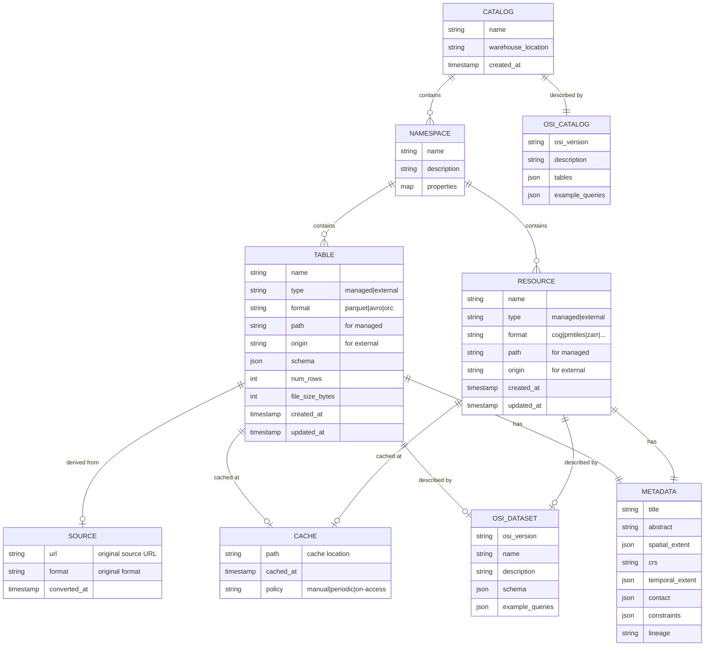
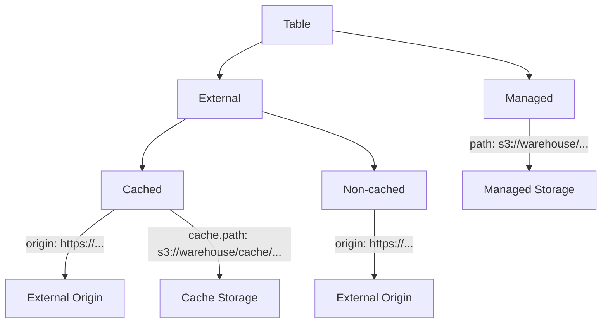
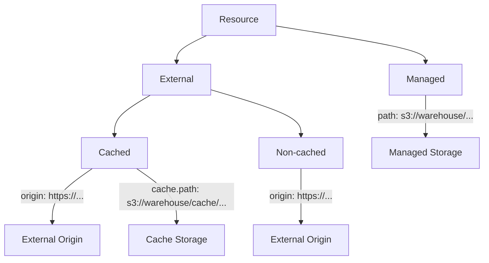

# Portolan Catalog Data Model

This document describes the data model for Portolan catalogs, including the distinction between **Tables** and **Resources**.

## Overview

A Portolan catalog contains two types of entries:

| Type | Description | Queryable | Storage |
|------|-------------|-----------|---------|
| **Table** | Iceberg table backed by Parquet/Avro/ORC | Yes (SQL) | Managed or external |
| **Resource** | Reference to non-tabular data (COG, PMTiles, Zarr, etc.) | No (needs specialized tools) | Managed or external |

Both tables and resources can be:
- **Managed**: Data stored in Portolan-controlled storage
- **External**: Data hosted elsewhere, referenced by URL
- **External + Cached**: External data with a local copy for SLA

## Data Format Pipeline

Resources progress through a **type-aware** lifecycle where the path depends on the data kind:

```
VECTOR:  EXTERNAL ──snapshot──▶ MATERIALIZED  (1 step, Iceberg is free)
         (origin)               (GeoParquet + Iceberg metadata)

RASTER:  EXTERNAL ──snapshot──▶ CACHED ──materialize──▶ MATERIALIZED
         (origin)               (COG/Zarr)               (Raquet + Iceberg)
```

| Kind | Origin (various) | snapshot produces | materialize produces |
|------|------------------|-------------------|----------------------|
| **Vector** | Shapefile, GeoJSON, WFS, ArcGIS FeatureServer, PostGIS, etc. | GeoParquet + Iceberg metadata (done!) | No-op (already materialized) |
| **Raster** | GeoTIFF, JPEG2000, ArcGIS ImageServer, STAC assets, etc. | COG or Zarr (cache only) | Raquet (QUADBIN indexed) + Iceberg |
| **Point Cloud** | LAS, LAZ, E57, etc. | COPC (cache only) | Pointquet + Iceberg |
| **Tileset** | MBTiles, PMTiles, 3D Tiles, etc. | Tilesets (cache only) | Tilequet + Iceberg |

### Why Type-Aware?

For **vector** data, the cache format (GeoParquet) is already Iceberg-compatible. Thanks to "lightweight Iceberg" (the `schema.name-mapping.default` property), we can register existing Parquet files without rewriting them. Iceberg registration is essentially free - just generating a few metadata JSON/Avro files.

For **raster** data, the cache format (COG/Zarr) is NOT Iceberg-compatible. Converting to Raquet requires expensive processing (reading pixels, spatial indexing with QUADBIN). So materialization remains an explicit step.

### Format Rationale

- **Cache stage**: Uses industry-standard cloud-native formats that are widely compatible and can be queried by common tools (GDAL, DuckDB, PDAL, etc.)
- **Materialized stage**: Uses the "quet" format family that adds spatial indexing (QUADBIN for raster) for Iceberg integration and efficient spatial queries
- **Lightweight Iceberg**: Vector data skips the separate materialization step because GeoParquet IS the Iceberg data format - we only need to add metadata

### Format Details

| Format | Description | Query Tools |
|--------|-------------|-------------|
| **GeoParquet** | Columnar vector format with geometry | DuckDB, GeoPandas, QGIS |
| **COG** | Cloud Optimized GeoTIFF | GDAL, rasterio, Titiler |
| **Zarr** | N-dimensional chunked arrays | Xarray, Zarr, GDAL |
| **COPC** | Cloud Optimized Point Cloud | PDAL, Potree |
| **Raquet** | GeoParquet with QUADBIN spatial indexing for raster | DuckDB + Iceberg |
| **Pointquet** | GeoParquet with spatial indexing for point clouds | DuckDB + Iceberg |
| **Tilequet** | GeoParquet with tile indexing | DuckDB + Iceberg |

### Cache Format Selection

The cache format is determined by the source:

| Source Type | Cache Format |
|-------------|--------------|
| ArcGIS ImageServer | COG (via raquet-io) |
| STAC raster assets | COG (downloaded) |
| Zarr archives | Zarr (referenced or downloaded) |
| NetCDF/HDF5 | Zarr (converted) |

## Value Proposition: SQL-Queryable Federated Discovery

A Portolan catalog provides value even with **zero data tables** - just by aggregating metadata from external sources (STAC, ArcGIS, CKAN).

### The Problem with Traditional SDI

| Traditional SDI | Pain Point |
|-----------------|------------|
| STAC API | Must learn STAC query syntax |
| CSW | Must learn XML filter syntax |
| ArcGIS Portal | Must learn ArcGIS REST API |
| Multiple catalogs | Different API per catalog |
| Limited query power | Can't do complex joins/aggregations |
| Hard for AI/LLMs | Each API has different semantics |

### Portolan Solution

Portolan stores all metadata in an **Iceberg table** that any SQL engine can query:

```sql
-- Find imagery datasets in Spain from 2024
-- Works with DuckDB, Snowflake, BigQuery, Databricks, etc.
SELECT
  name,
  title,
  format,
  origin,
  contact.organization
FROM catalog.metadata.items
WHERE topic_category = 'imageryBaseMapsEarthCover'
  AND spatial_extent.west > -10
  AND spatial_extent.east < 5
  AND temporal_extent.start >= '2024-01-01'
ORDER BY created_at DESC;
```

### Federated Catalog Aggregation

Import from multiple sources, query with one interface:

```
┌─────────────────┐     ┌─────────────────┐     ┌─────────────────┐
│   STAC Catalog  │     │  ArcGIS Portal  │     │      CKAN       │
│ (earth-search)  │     │  (data.gov.xx)  │     │  (open data)    │
└────────┬────────┘     └────────┬────────┘     └────────┬────────┘
         │                       │                       │
         │       portolan import stac/arcgis/ckan        │
         └───────────────────────┼───────────────────────┘
                                 ▼
              ┌─────────────────────────────────┐
              │       Portolan Catalog          │
              │   (Iceberg metadata tables)     │
              │                                 │
              │  ┌─────────────────────────┐    │
              │  │ items (metadata table)  │    │
              │  │ - ISO 19115 fields      │    │
              │  │ - STAC fields           │    │
              │  │ - OSI semantic hints    │    │
              │  └─────────────────────────┘    │
              └───────────────┬─────────────────┘
                              │
      ┌───────────────────────┼───────────────────────┐
      ▼                       ▼                       ▼
┌───────────┐          ┌───────────┐          ┌───────────┐
│    SQL    │          │   STAC    │          │  OGC CSW  │
│  (query)  │          │   API     │          │   API     │
└───────────┘          └───────────┘          └───────────┘
```

The actual data stays external - Portolan only aggregates and indexes **metadata**.

## Open Semantic Interchange (OSI)

[Open Semantic Interchange](https://opensemanticinterchange.org/) provides machine-readable semantic descriptions that help AI/LLMs understand how to query data.

### OSI at Two Levels

```
┌─────────────────────────────────────────────────────────────┐
│                  Catalog-Level OSI                          │
│  "This catalog has an 'items' table with these columns..."  │
│  "Use spatial_extent.west/east/south/north for bbox..."     │
│  "topic_category uses ISO 19115 codes..."                   │
└─────────────────────────────────────────────────────────────┘
                              │
                              ▼ AI reads, generates SQL
┌─────────────────────────────────────────────────────────────┐
│  SELECT * FROM items WHERE topic_category = 'elevation'     │
└─────────────────────────────────────────────────────────────┘
                              │
                              ▼ Results include dataset OSI
┌─────────────────────────────────────────────────────────────┐
│                  Dataset-Level OSI                          │
│  "This elevation dataset has columns: x, y, elevation_m..." │
│  "elevation_m is meters above sea level (EPSG:5773)..."     │
└─────────────────────────────────────────────────────────────┘
                              │
                              ▼ AI reads, generates SQL for data
┌─────────────────────────────────────────────────────────────┐
│  SELECT AVG(elevation_m) FROM elevation_data                │
│  WHERE ST_Within(geometry, ST_MakeEnvelope(...))            │
└─────────────────────────────────────────────────────────────┘
```

### Catalog-Level OSI Schema

The catalog includes an OSI description of its own structure:

```yaml
# Stored at: catalog/osi/catalog.osi.yaml
osi_version: "1.0"
name: "Portolan Catalog"
description: "Federated spatial data catalog with ISO 19115 + STAC metadata"

tables:
  items:
    description: "Metadata for all tables and resources in the catalog"
    columns:
      name:
        type: string
        description: "Unique identifier for the entry"
      title:
        type: string
        description: "Human-readable title"
      type:
        type: string
        enum: [table, resource]
        description: "Whether this is a queryable table or external resource"
      format:
        type: string
        description: "Data format (parquet, cog, pmtiles, zarr, etc.)"
      spatial_extent:
        type: object
        description: "Geographic bounding box"
        properties:
          west: { type: number, description: "Western longitude (-180 to 180)" }
          east: { type: number, description: "Eastern longitude (-180 to 180)" }
          south: { type: number, description: "Southern latitude (-90 to 90)" }
          north: { type: number, description: "Northern latitude (-90 to 90)" }
      topic_category:
        type: string
        description: "ISO 19115 topic category"
        enum: [farming, biota, boundaries, climatologyMeteorologyAtmosphere, ...]
      origin:
        type: string
        description: "URL to external data (for external tables/resources)"

example_queries:
  - description: "Find all imagery datasets"
    sql: "SELECT * FROM items WHERE topic_category = 'imageryBaseMapsEarthCover'"

  - description: "Find datasets within a bounding box"
    sql: |
      SELECT * FROM items
      WHERE spatial_extent.west >= -10
        AND spatial_extent.east <= 5
        AND spatial_extent.south >= 35
        AND spatial_extent.north <= 45

  - description: "Find datasets from a specific organization"
    sql: "SELECT * FROM items WHERE contact.organization LIKE '%ESA%'"
```

### Dataset-Level OSI

Each table or resource can have its own OSI description:

```yaml
# Stored at: catalog/osi/datasets/{dataset_name}.osi.yaml
osi_version: "1.0"
name: "administrative_boundaries"
description: "Official administrative boundaries including municipalities and regions"

schema:
  columns:
    id:
      type: string
      description: "Unique boundary identifier (ISO 3166-2 code)"
    name:
      type: string
      description: "Official name of the administrative unit"
    admin_level:
      type: integer
      description: "Administrative level (1=country, 2=region, 3=province, 4=municipality)"
    population:
      type: integer
      description: "Population count (latest census)"
    geometry:
      type: geometry
      srid: 4326
      geometry_type: MultiPolygon
      description: "Boundary polygon in WGS84"

example_queries:
  - description: "Get all municipalities (admin_level 4)"
    sql: "SELECT name, population FROM administrative_boundaries WHERE admin_level = 4"

  - description: "Find boundaries containing a point"
    sql: |
      SELECT name, admin_level
      FROM administrative_boundaries
      WHERE ST_Contains(geometry, ST_Point(-3.7, 40.4))
```

### OSI Storage Layout

```
catalog/
├── osi/
│   ├── catalog.osi.yaml      # Catalog-level OSI (how to query the catalog)
│   └── datasets/
│       ├── boundaries.osi.yaml
│       ├── elevation.osi.yaml
│       └── imagery.osi.yaml
├── v1/                        # Iceberg REST catalog
├── stac/                      # STAC (if enabled)
└── data/                      # Actual data files
```

### AI Discovery Workflow

With OSI, an AI agent can autonomously navigate the catalog:

1. **Read catalog OSI** → Understand catalog structure and query patterns
2. **Query catalog** → Find relevant datasets using SQL
3. **Read dataset OSI** → Understand specific dataset schema
4. **Query data** → Extract insights from the actual data

```python
# Example AI workflow (pseudocode)
catalog_osi = fetch("s3://catalog/osi/catalog.osi.yaml")
# AI now knows: "items table has spatial_extent, topic_category, etc."

datasets = query("SELECT name, title FROM items WHERE topic_category = 'elevation'")
# AI found: elevation_spain dataset

dataset_osi = fetch(f"s3://catalog/osi/datasets/{datasets[0].name}.osi.yaml")
# AI now knows: "elevation_m column is meters above sea level"

result = query("SELECT AVG(elevation_m) FROM elevation_spain WHERE region = 'Pyrenees'")
# AI got the answer
```

## Entity Relationship Diagram



## Common Metadata (ISO 19115 + STAC)

Both tables and resources share a common metadata structure based on ISO 19115 and STAC standards. This enables SDI compliance and interoperability.

### Identification

| Field | Type | Required | Description | ISO 19115 Element |
|-------|------|----------|-------------|-------------------|
| `title` | string | yes | Human-readable name | MD_Identification.citation.title |
| `abstract` | string | no | Description of the dataset | MD_Identification.abstract |
| `purpose` | string | no | Why the dataset was created | MD_Identification.purpose |
| `keywords` | array[string] | no | Discoverable keywords | MD_Keywords.keyword |
| `topic_category` | string | no | ISO topic category | MD_TopicCategoryCode |

**Topic Categories** (ISO 19115):
`farming`, `biota`, `boundaries`, `climatologyMeteorologyAtmosphere`, `economy`, `elevation`, `environment`, `geoscientificInformation`, `health`, `imageryBaseMapsEarthCover`, `intelligenceMilitary`, `inlandWaters`, `location`, `oceans`, `planningCadastre`, `society`, `structure`, `transportation`, `utilitiesCommunication`

### Spatial Reference

| Field | Type | Required | Description | ISO 19115 Element |
|-------|------|----------|-------------|-------------------|
| `spatial_extent` | object | no | Bounding box | EX_GeographicBoundingBox |
| `spatial_extent.west` | number | yes | Western longitude | westBoundLongitude |
| `spatial_extent.east` | number | yes | Eastern longitude | eastBoundLongitude |
| `spatial_extent.south` | number | yes | Southern latitude | southBoundLatitude |
| `spatial_extent.north` | number | yes | Northern latitude | northBoundLatitude |
| `crs` | string | no | Coordinate reference system | MD_ReferenceSystem |
| `spatial_resolution` | number | no | Ground sample distance (meters) | MD_Resolution |
| `spatial_representation` | string | no | `vector`, `grid`, `tin`, `point-cloud` | MD_SpatialRepresentationTypeCode |

### Temporal Reference

| Field | Type | Required | Description | ISO 19115 Element |
|-------|------|----------|-------------|-------------------|
| `temporal_extent` | object | no | Time period covered | EX_TemporalExtent |
| `temporal_extent.start` | timestamp | no | Start date/time | beginPosition |
| `temporal_extent.end` | timestamp | no | End date/time | endPosition |
| `datetime` | timestamp | no | Single datetime (if not a range) | STAC datetime |
| `reference_date` | timestamp | no | Publication/revision date | CI_Date |
| `reference_date_type` | string | no | `publication`, `revision`, `creation` | CI_DateTypeCode |

### Contact Information

| Field | Type | Required | Description | ISO 19115 Element |
|-------|------|----------|-------------|-------------------|
| `contact` | object | no | Responsible party | CI_ResponsibleParty |
| `contact.name` | string | no | Individual name | individualName |
| `contact.organization` | string | yes | Organization name | organisationName |
| `contact.email` | string | no | Contact email | electronicMailAddress |
| `contact.role` | string | yes | Role of the party | CI_RoleCode |

**Role Codes** (ISO 19115):
`resourceProvider`, `custodian`, `owner`, `user`, `distributor`, `originator`, `pointOfContact`, `principalInvestigator`, `processor`, `publisher`, `author`

### Constraints

| Field | Type | Required | Description | ISO 19115 Element |
|-------|------|----------|-------------|-------------------|
| `license` | string | no | License identifier (SPDX) | MD_LegalConstraints |
| `license_url` | string | no | URL to license text | - |
| `access_constraints` | string | no | Access restrictions | MD_RestrictionCode |
| `use_constraints` | string | no | Usage restrictions | MD_RestrictionCode |
| `other_constraints` | string | no | Additional constraints | otherConstraints |
| `security_classification` | string | no | `unclassified`, `restricted`, `confidential`, `secret` | MD_ClassificationCode |

### Quality & Lineage

| Field | Type | Required | Description | ISO 19115 Element |
|-------|------|----------|-------------|-------------------|
| `lineage` | string | no | Processing history description | LI_Lineage.statement |
| `source` | object | no | Original data source | LI_Source |
| `source.url` | string | no | Source URL or path | - |
| `source.format` | string | no | Original format | - |
| `source.converted_at` | timestamp | no | Conversion timestamp | - |
| `quality_scope` | string | no | Quality assessment scope | DQ_Scope |

### Administrative

| Field | Type | Required | Description | ISO 19115 Element |
|-------|------|----------|-------------|-------------------|
| `created_at` | timestamp | yes | When the entry was created | dateStamp |
| `updated_at` | timestamp | yes | When the entry was last updated | dateStamp |
| `metadata_contact` | object | no | Who created the metadata | MD_Metadata.contact |
| `metadata_language` | string | no | Metadata language (ISO 639-1) | language |

### STAC Extensions

| Field | Type | Description |
|-------|------|-------------|
| `stac_id` | string | STAC item ID |
| `geometry` | GeoJSON | Item footprint |
| `assets` | object | Asset dictionary |
| `links` | array | Related links |
| `collection` | string | Parent STAC collection |

## Tables

Tables are Iceberg tables backed by Parquet (or Avro/ORC). They can be managed (data in your storage) or external (data at remote URL).

### Table Types



### Table Schema

| Field | Type | Required | Description |
|-------|------|----------|-------------|
| `name` | string | yes | Table identifier |
| `type` | string | yes | `managed` or `external` |
| `format` | string | yes | Data format: `parquet`, `avro`, `orc` |
| `path` | string | if managed | Storage path (relative to warehouse) |
| `origin` | string | if external | External URL |
| `cache` | object | no | Cache config (external only) |
| `iceberg_schema` | object | yes | Iceberg schema (JSON) |
| `num_rows` | integer | yes | Row count |
| `file_size_bytes` | integer | yes | Size of data files |
| *+ all common metadata fields* | | | |

### Managed Table Example

```yaml
table:
  name: administrative-boundaries
  type: managed
  format: parquet
  path: data/boundaries/boundaries.parquet

  # Iceberg-specific
  iceberg_schema: {...}
  num_rows: 15420
  file_size_bytes: 2458000

  # Identification
  title: "Administrative Boundaries 2024"
  abstract: "Official administrative boundaries including municipalities, provinces, and regions."
  keywords: ["boundaries", "administrative", "government"]
  topic_category: boundaries

  # Spatial
  spatial_extent:
    west: -9.5
    south: 36.0
    east: 3.3
    north: 43.8
  crs: EPSG:4326
  spatial_representation: vector

  # Temporal
  temporal_extent:
    start: 2024-01-01T00:00:00Z
    end: 2024-12-31T23:59:59Z
  reference_date: 2024-01-15T00:00:00Z
  reference_date_type: publication

  # Contact
  contact:
    organization: "National Geographic Institute"
    email: "data@ign.example.gov"
    role: publisher

  # Constraints
  license: CC-BY-4.0
  license_url: https://creativecommons.org/licenses/by/4.0/
  access_constraints: unrestricted

  # Lineage
  lineage: "Derived from official cadastral records and validated against satellite imagery."
  source:
    url: https://data.gov.example/boundaries.shp
    format: shapefile
    converted_at: 2024-01-10T08:30:00Z

  # Administrative
  created_at: 2024-01-15T10:00:00Z
  updated_at: 2024-06-01T14:30:00Z
```

### External Table Example

```yaml
table:
  name: source-coop-buildings
  type: external
  format: parquet
  origin: https://data.source.coop/vida/google-microsoft-open-buildings/geoparquet/by_country/country_iso=ES/part-0.parquet

  # Iceberg metadata generated locally, points to external data
  iceberg_schema: {...}
  num_rows: 12500000
  file_size_bytes: 890000000

  title: "Google-Microsoft Open Buildings - Spain"
  abstract: "Building footprints for Spain from the combined Google-Microsoft dataset."
  keywords: ["buildings", "footprints", "AI-derived"]
  topic_category: structure

  spatial_extent:
    west: -9.5
    south: 36.0
    east: 3.3
    north: 43.8
  crs: EPSG:4326

  contact:
    organization: "Source Cooperative"
    role: distributor

  license: ODbL-1.0

  created_at: 2024-02-01T12:00:00Z
  updated_at: 2024-02-01T12:00:00Z
```

### External Table with Cache

```yaml
table:
  name: osm-buildings
  type: external
  format: parquet
  origin: https://example.com/osm-buildings.parquet
  cache:
    path: cache/osm-buildings.parquet
    cached_at: 2026-02-01T12:00:00Z
    policy: periodic

  title: "OpenStreetMap Buildings"
  # ... other metadata
```

## Resources

Resources are references to non-tabular data that cannot be represented as Iceberg tables. They require specialized tools to access and process.

### Supported Formats

| Format | Description | Example Tools |
|--------|-------------|---------------|
| `cog` | Cloud Optimized GeoTIFF | GDAL, rasterio, Titiler |
| `pmtiles` | Protomaps tiles archive | PMTiles viewer, MapLibre |
| `zarr` | N-dimensional arrays | Xarray, Zarr |
| `3dtiles` | 3D geospatial tiles | CesiumJS, deck.gl |
| `copc` | Cloud Optimized Point Cloud | PDAL, Potree |
| `flatgeobuf` | Streaming vector format | GDAL, leaflet-flatgeobuf |
| `geoparquet` | GeoParquet (when not converted to table) | DuckDB, GeoPandas |

### Resource Types



### Resource Schema

| Field | Type | Required | Description |
|-------|------|----------|-------------|
| `name` | string | yes | Resource identifier |
| `type` | string | yes | `managed` or `external` |
| `format` | string | yes | Data format (see supported formats) |
| `path` | string | if managed | Storage path for managed resources |
| `origin` | string | if external | External URL for external resources |
| `cache` | object | no | Cache configuration (external only) |
| `cache.path` | string | if cached | Cache storage path |
| `cache.cached_at` | timestamp | if cached | When the cache was created/updated |
| `cache.policy` | string | if cached | `manual`, `periodic`, or `on-access` |
| `auth_hint` | string | no | Auth type: `none`, `api-key`, `oauth`, `s3-iam`, `signed-url` |
| `properties` | object | no | Format-specific metadata |
| *+ all common metadata fields* | | | |

### Managed Resource Example

```yaml
resource:
  name: imagery-2024
  type: managed
  format: cog
  path: data/imagery/2024.tif

  title: "Aerial Imagery 2024"
  abstract: "High-resolution aerial imagery captured in summer 2024."
  keywords: ["imagery", "aerial", "orthophoto"]
  topic_category: imageryBaseMapsEarthCover

  spatial_extent:
    west: -122.5
    south: 37.5
    east: -122.0
    north: 38.0
  crs: EPSG:4326
  spatial_resolution: 0.5
  spatial_representation: grid

  temporal_extent:
    start: 2024-06-01T00:00:00Z
    end: 2024-08-31T23:59:59Z

  contact:
    organization: "Regional Mapping Agency"
    email: "imagery@mapping.example.gov"
    role: originator

  license: CC-BY-4.0

  # Format-specific properties
  properties:
    num_bands: 4
    band_names: ["red", "green", "blue", "nir"]
    compression: deflate
    block_size: 512

  created_at: 2024-09-01T10:00:00Z
  updated_at: 2024-09-01T10:00:00Z
```

### External Resource Example

```yaml
resource:
  name: sentinel-scene
  type: external
  format: cog
  origin: https://sentinel-cogs.s3.amazonaws.com/sentinel-s2-l2a-cogs/2024/...

  title: "Sentinel-2 Scene"
  abstract: "Sentinel-2 L2A scene from the AWS open data registry."
  topic_category: imageryBaseMapsEarthCover

  spatial_extent:
    west: -122.5
    south: 37.5
    east: -122.0
    north: 38.0
  crs: EPSG:4326

  contact:
    organization: "European Space Agency"
    role: originator

  license: CC-BY-SA-3.0-IGO

  auth_hint: none  # Public S3 bucket

  created_at: 2024-10-15T08:00:00Z
  updated_at: 2024-10-15T08:00:00Z
```

### External Resource with Cache

```yaml
resource:
  name: basemap-tiles
  type: external
  format: pmtiles
  origin: https://external-provider.com/tiles/basemap.pmtiles
  cache:
    path: cache/basemap.pmtiles
    cached_at: 2026-02-01T12:00:00Z
    policy: periodic

  title: "Global Basemap Tiles"
  # ... other metadata
```

## Security Model

Security depends on storage location:

| Entry Type | Storage | Security |
|------------|---------|----------|
| Table (managed) | Managed | Storage-level controls (IAM, policies) |
| Table (external) | External | Delegated to external system |
| Table (external, cached) | Both | Managed for cache, external for refresh |
| Resource (managed) | Managed | Storage-level controls (IAM, policies) |
| Resource (external) | External | Delegated to external system |
| Resource (external, cached) | Both | Managed for cache, external for refresh |

For external entries, the catalog stores **auth hints** (not credentials) to indicate what type of authentication is required. Actual credentials are never stored in the catalog.

## Catalog Storage Layout

```
warehouse/
├── v1/                           # Iceberg REST catalog endpoints
│   └── {prefix}/
│       └── namespaces/
│           └── {namespace}/
│               ├── tables/       # Table metadata
│               └── resources/    # Resource metadata
├── osi/                          # Open Semantic Interchange metadata
│   ├── catalog.osi.yaml          # Catalog-level OSI (how to query catalog)
│   └── datasets/                 # Per-dataset OSI
│       ├── {table}.osi.yaml
│       └── {resource}.osi.yaml
├── stac/                         # STAC catalog (if enabled)
│   ├── catalog.json
│   └── collections/
│       └── {collection}/
├── ogc/                          # OGC endpoints (if enabled)
│   ├── records/                  # OGC API - Records
│   └── csw/                      # CSW GetCapabilities/GetRecords
├── dcat/                         # GeoDCAT-AP (if enabled)
│   └── catalog.jsonld
├── data/
│   └── {namespace}/
│       ├── {table}/              # Managed table data (Parquet)
│       └── {resource}/           # Managed resource data
├── cache/                        # Cached external data
│   └── {namespace}/
│       ├── {table}/
│       └── {resource}/
└── manifest.json                 # Catalog index
```

## CLI Operations

### Tables

```bash
# Add a managed table from local Parquet file
portolan table add data.parquet --namespace geo --name boundaries

# Register an external table
portolan table add --external https://source.coop/data.parquet --name buildings

# Add with full metadata
portolan table add data.parquet \
  --title "Administrative Boundaries" \
  --abstract "Official boundaries dataset" \
  --contact-org "National Geographic Institute" \
  --contact-email "data@ign.gov" \
  --license CC-BY-4.0 \
  --topic-category boundaries

# Cache an external table
portolan table cache buildings

# Refresh cache
portolan table refresh buildings

# Evict cache (keep external reference)
portolan table evict buildings

# List tables
portolan table list [--namespace <ns>]
```

### Resources

```bash
# Register a managed resource
portolan resource add imagery.tif --namespace geo --name imagery-2024

# Register an external resource
portolan resource add --external https://example.com/data.cog --name sentinel

# Add with metadata
portolan resource add imagery.tif \
  --title "Aerial Imagery 2024" \
  --contact-org "Mapping Agency" \
  --license CC-BY-4.0

# Cache an external resource
portolan resource cache sentinel

# Refresh a cached resource
portolan resource refresh sentinel

# Evict cache (keep reference)
portolan resource evict sentinel

# Convert resource to table (if format supports it)
portolan resource persist my-geojson --as my-table
```

### Import from External Catalogs

```bash
# Import from STAC catalog
portolan import stac https://earth-search.aws.element84.com/v1

# Import from ArcGIS Portal
portolan import arcgis https://portal.example.com/arcgis

# Import from CKAN
portolan import ckan https://data.gov
```

## Compatibility Layers

Portolan can generate multiple catalog formats for interoperability with existing SDI infrastructure.

### Supported Standards

| Standard | Type | Format | Use Case |
|----------|------|--------|----------|
| **Iceberg REST** | API | REST/JSON | Core catalog, query engines (DuckDB, Snowflake, etc.) |
| **OGC API - Records** | API | REST/JSON | Modern SDI catalog API |
| **STAC** | API/Static | REST/JSON | Cloud-native geospatial community |
| **OGC CSW** | API | XML/SOAP | Legacy SDI systems, INSPIRE, GeoNetwork |
| **ISO 19139** | Encoding | XML | Metadata exchange format (returned by CSW) |
| **GeoDCAT-AP** | Encoding | RDF/JSON-LD | EU open data portals, data.europa.eu |

### Generated Endpoints

When services are enabled, Portolan generates static files (or lightweight proxies) for each:

```
warehouse/
├── v1/                    # Iceberg REST catalog (always)
├── stac/                  # STAC catalog
│   ├── catalog.json
│   └── collections/
│       └── {collection}/
│           ├── collection.json
│           └── items/
├── ogc/
│   ├── records/           # OGC API - Records
│   │   └── collections/
│   │       └── {collection}/
│   │           └── items/
│   └── csw/               # CSW GetCapabilities, GetRecords responses
│       ├── capabilities.xml
│       └── records/
└── dcat/                  # GeoDCAT-AP
    └── catalog.ttl        # RDF/Turtle or JSON-LD
```

### Service Selection

Services are configured in `portolan.yaml` and checked by the CLI when adding or updating entries.

## Configuration

Portolan uses a `portolan.yaml` file for local configuration. The cloud storage catalog is always the source of truth.

### Architecture

```
┌─────────────────────────────────────────────────────────────┐
│                    Cloud Storage (Source of Truth)          │
│  s3://my-bucket/catalog/                                    │
│  ├── v1/                    # Iceberg REST catalog          │
│  ├── stac/                  # STAC catalog (if enabled)     │
│  ├── ogc/                   # OGC endpoints (if enabled)    │
│  └── data/                  # Parquet files, COGs, etc.     │
└─────────────────────────────────────────────────────────────┘
                              ▲
                              │ read/write
                              │
┌─────────────────────────────────────────────────────────────┐
│                         CLI                                 │
│  portolan dataset add, portolan resource add, etc.          │
└─────────────────────────────────────────────────────────────┘
                              │
                              │ uses
                              ▼
┌─────────────────────────────┬───────────────────────────────┐
│      portolan.yaml          │        .portolan/             │
│   (connection + defaults)   │   (temp working directory)    │
│   - version controlled      │   - intermediate files        │
│   - user-edited             │   - cleaned up after upload   │
└─────────────────────────────┴───────────────────────────────┘
```

### Workflow

```bash
# Create a NEW catalog on cloud storage
portolan init s3://my-bucket/catalog --name "My SDI"
# → Creates Iceberg catalog directly on cloud storage
# → Saves connection info in local portolan.yaml

# OR connect to an EXISTING catalog
portolan connect s3://some-bucket/existing-catalog
# → Validates it's a valid Portolan/Iceberg catalog
# → Saves connection info in local portolan.yaml

# Add a dataset (operates on remote)
portolan dataset add boundaries.parquet --title "Boundaries"
# → Generates metadata in .portolan/ (temp)
# → Uploads parquet + metadata to cloud storage
# → Cleans up .portolan/

# Read-only access to public catalogs
portolan connect https://public-catalog.example.com --readonly
portolan dataset list
```

### Configuration Schema

```yaml
# portolan.yaml

# Remote catalog connection (source of truth)
remote:
  url: "s3://my-bucket/catalog"
  region: "eu-west-1"
  # Credentials via environment variables
  access_key: "${AWS_ACCESS_KEY_ID}"
  secret_key: "${AWS_SECRET_ACCESS_KEY}"
  # Or use a profile
  # profile: "my-aws-profile"

# Catalog metadata (stored on remote, cached locally)
catalog:
  name: "My Organization SDI"
  description: "Spatial Data Infrastructure for My Organization"

# Enabled compatibility services
# These are stored on the remote catalog and regenerated on changes
services:
  # Core Iceberg REST (always enabled)
  iceberg_rest:
    enabled: true
    prefix: "warehouse"

  # STAC catalog
  stac:
    enabled: true
    version: "1.0.0"

  # OGC API - Records
  ogc_api_records:
    enabled: true
    version: "1.0"

  # Legacy CSW (opt-in for INSPIRE/government)
  csw:
    enabled: false
    version: "3.0.0"
    profile: "iso19139"  # or "iso19139-2", "gmd"

  # GeoDCAT-AP for EU data portals
  geodcat:
    enabled: false
    profile: "geodcat-ap-2.0"
    format: "jsonld"  # or "turtle", "rdfxml"

# Default metadata (applied to new entries if not specified via CLI)
defaults:
  contact:
    organization: "My Organization"
    email: "data@example.org"
    role: "publisher"

  license: "CC-BY-4.0"
  license_url: "https://creativecommons.org/licenses/by/4.0/"
  access_constraints: "unrestricted"

  crs: "EPSG:4326"
  metadata_language: "en"
```

### CLI Behavior

When you run catalog operations, the CLI:
1. Reads `portolan.yaml` for connection info and defaults
2. Connects to the remote catalog (source of truth)
3. Generates any needed files in `.portolan/` (temp)
4. Uploads changes to the remote
5. Cleans up temp files

```bash
# Initialize a new catalog on cloud storage
portolan init s3://my-bucket/catalog \
  --name "My SDI" \
  --enable stac \
  --enable ogc-api-records
# → Creates catalog structure on S3
# → Saves connection to portolan.yaml

# Connect to existing catalog
portolan connect s3://other-bucket/catalog
# → Validates catalog exists
# → Updates portolan.yaml with new connection

# Add a dataset - CLI checks services config to know what to update
portolan dataset add boundaries.parquet --title "Admin Boundaries"
# → Reads remote catalog state
# → Generates metadata in .portolan/ (temp)
# → Uploads to remote:
#   - Iceberg catalog (always)
#   - STAC item (if enabled)
#   - OGC Records entry (if enabled)
#   - CSW record (if enabled)

# Enable/disable services (updates remote catalog config)
portolan config set services.csw.enabled true
portolan config set services.geodcat.enabled true
# → Regenerates affected compatibility layers on remote

# View current config
portolan config show

# Set defaults (local only, for convenience)
portolan config set defaults.contact.organization "New Org Name"
portolan config set defaults.license "CC0-1.0"
```

### Configuration Precedence

1. **CLI flags** (highest) - `--license MIT` overrides everything
2. **Config defaults** - from `portolan.yaml`
3. **Built-in defaults** (lowest) - sensible fallbacks

### Minimal Config

For simple use cases, only the remote URL is required:

```yaml
# Minimal portolan.yaml (created by `portolan init` or `portolan connect`)
remote:
  url: "s3://my-bucket/catalog"
```

All services default to disabled except Iceberg REST, and metadata defaults must be provided per-entry via CLI flags.

### Environment Variables

Sensitive values can use environment variable references:

```yaml
remotes:
  origin:
    url: "s3://my-bucket/portolan"
    access_key: "${AWS_ACCESS_KEY_ID}"
    secret_key: "${AWS_SECRET_ACCESS_KEY}"
```

## Future Considerations

- **Views**: Virtual tables defined by SQL queries over other tables
- **Collections**: Grouping mechanism for related tables and resources
- **Versioning**: Track changes to resources over time
- **Federation**: Reference tables/resources from other Portolan catalogs
- **Validation**: Schema validation for metadata completeness (bronze/silver/gold tiers)
- **Harvesting**: Scheduled sync from external catalogs (STAC, CSW, CKAN)
- **Webhooks**: Notify external systems when catalog changes
